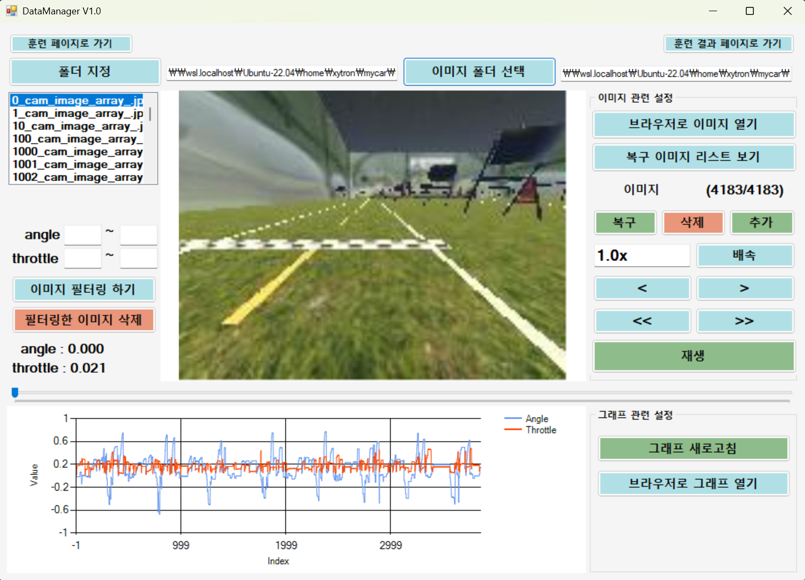
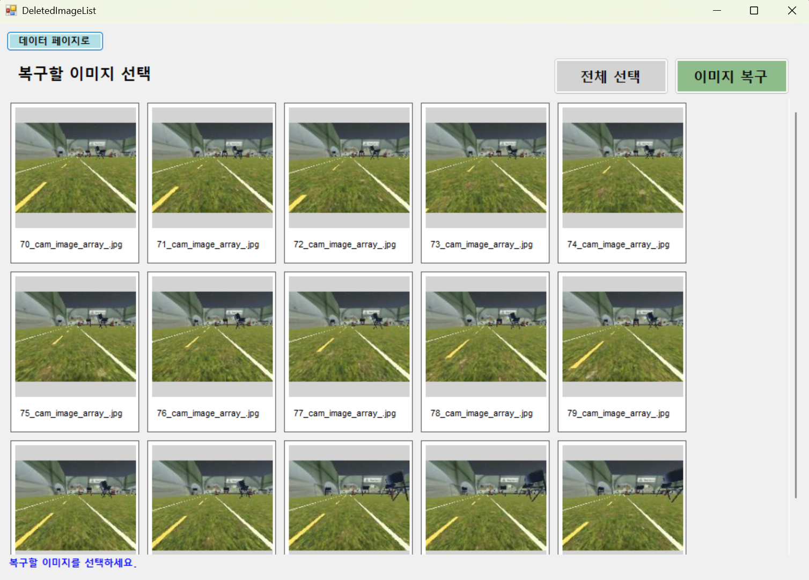
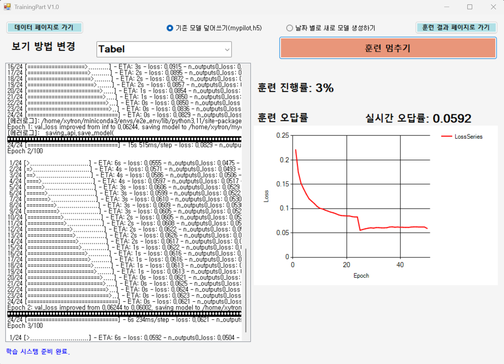
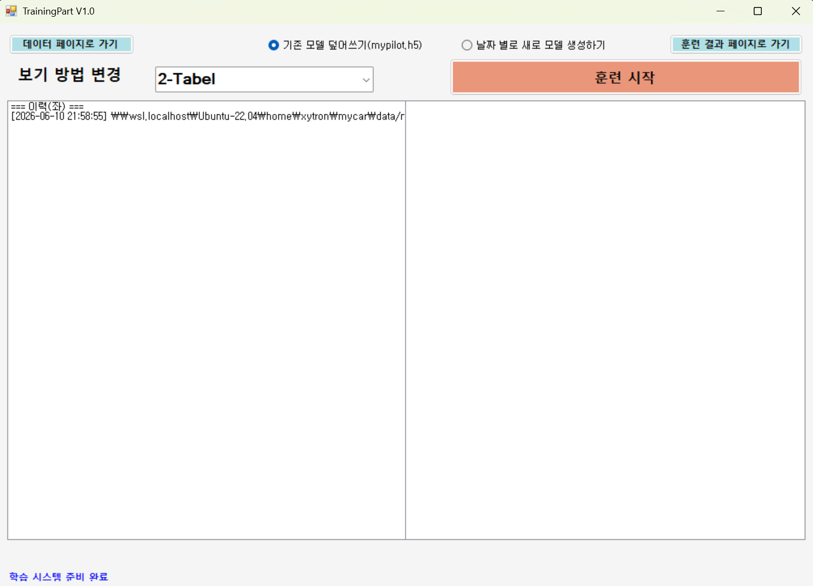
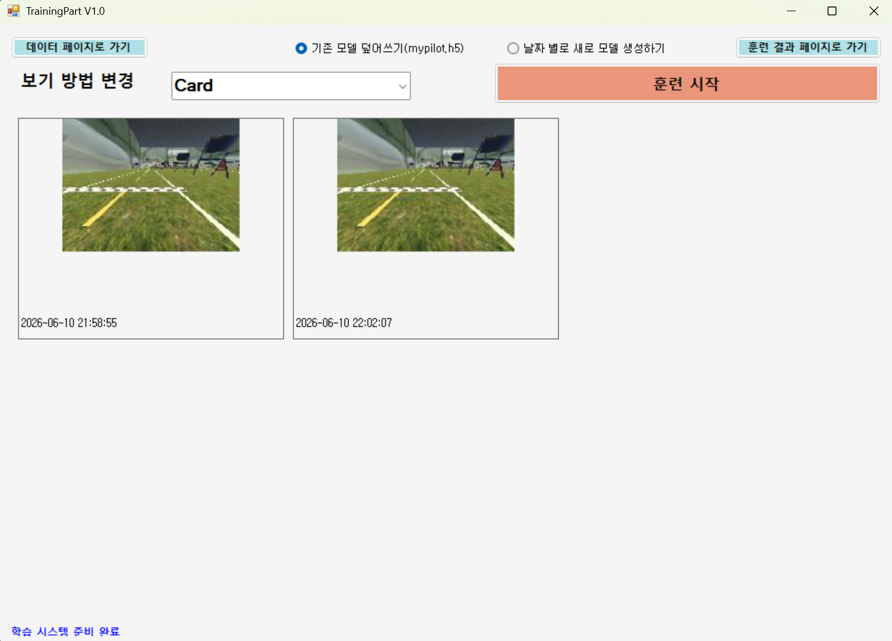
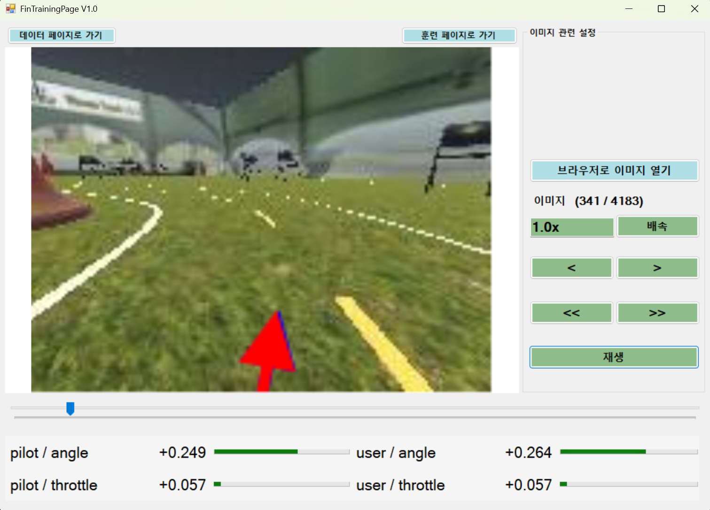

# 🚗 DataManager

### DonkeyCar 데이터 관리 및 AI 학습 지원 프로그램

자율주행 차량 DonkeyCar의 주행 데이터를 시각적으로 관리하고,
AI 모델 학습을 보다 편리하게 수행할 수 있도록 제작된 Windows 기반 데이터 관리 도구입니다.

---

## 👨‍💻 Team DataManager

| 이름 | 역할 | 담당 업무 |
|------|------|----------|
| 👑 장윤서 | Team Leader | Python 연동, AI 학습 기능 구현 |
| 🎨 강민영 | UI Developer | WinForms UI 설계 및 구현 |
| ⚙️ 유예빈 | Backend Developer | DataManager 기능 구현 |

---


## 📖 프로젝트 소개

DataManager는 DonkeyCar 프로젝트에서 생성되는 주행 데이터를 관리하기 위한 Windows Forms 기반 애플리케이션입니다.

DonkeyCar는 카메라 기반 자율주행 차량 플랫폼으로, 사용자가 차량을 직접 조종하며 수집한 데이터를 기반으로 AI 모델을 학습시켜 자율주행을 수행합니다.

본 프로그램은 수천 장의 주행 이미지와 주행 정보를 보다 쉽게 확인하고 관리할 수 있도록 설계되었으며, 데이터 검수부터 AI 학습 실행, 학습 결과 확인까지 하나의 인터페이스에서 수행할 수 있습니다.

---

## 🎯 프로젝트 목표

* DonkeyCar 데이터셋 시각화
* 주행 데이터 관리 및 정제
* 학습 데이터 품질 향상
* Python 기반 AI 학습 실행 지원
* C#과 Python 간 연동 기술 학습

---

## 🏗 시스템 구조

```text
WinForms UI (C#)
        │
        ▼
Python (DonkeyCar)
        │
        ▼
AI 학습 및 데이터 처리
```

사용자는 WinForms 환경에서 데이터를 관리하고, Python 학습 스크립트를 실행하여 모델을 학습시킬 수 있습니다.

---

## ✨ 주요 기능

### 📂 데이터 로드

* DonkeyCar 데이터 폴더 선택
* catalog 파일 자동 로딩
* 이미지 파일 자동 매핑

### 🖼 데이터 조회

* 프레임별 이미지 확인
* Angle 값 확인
* Throttle 값 확인

### 🎚 프레임 탐색

* TrackBar 기반 탐색
* 특정 프레임 이동
* 빠른 데이터 검수

### 🔍 데이터 필터링

예시:

* throttle > 0
* angle = 0 제외

불필요하거나 학습에 적합하지 않은 데이터를 쉽게 확인할 수 있습니다.

### 🗑 데이터 삭제 및 복구

* 잘못 수집된 데이터 제거
* catalog 정보 삭제
* 이미지 파일 삭제

### 🤖 AI 학습 실행

버튼 클릭만으로 Python 학습 스크립트를 실행할 수 있습니다.

```bash
python manage.py train
```

학습 로그를 UI에서 실시간으로 확인할 수 있습니다.

### 📊 데이터 시각화

* Angle 변화 그래프
* 데이터 분포 확인
* 학습 데이터 분석

---

## 📁 DonkeyCar 데이터 구조

```text
data/
├── images/
│   ├── 0_cam_image_array_.jpg
│   ├── 1_cam_image_array_.jpg
│   └── ...
│
└── catalog_0.catalog
```

catalog 파일은 JSON Lines 형식으로 저장됩니다.

```json
{
  "_index": 0,
  "cam/image_array": "0_cam_image_array_.jpg",
  "user/angle": -0.05,
  "user/throttle": 1.0
}
```

---

## 🛠 기술 스택

### Frontend

* C#
* Windows Forms (.NET)
* .NET SDK 8.0

### Backend

* Python
* DonkeyCar 5.3.dev1

### Data Processing

* JSON Parsing
* File I/O
* Image Processing
* Ubuntu 22.04

### Development Environment

* Visual Studio 2026
* Windows 11

---

## 📸 주요 화면

### 데이터 조회 화면
<p>
  
</p>

* 이미지 넘겨보기 (한 칸 넘기기, 연속 넘기기)
* 이미지 재생 배속 기능
* Frame 정보 출력
* label을 통한 Angle / Throttle 값 표시
* trackbar 슬라이더 기반 탐색
* 브라우저로 이미지 열기
* 이미지 복구, 삭제 (한 장, 구간)
* 복구 이미지 리스트 보기
* number, angle, throttle 값을 통한 필터링 기능
* 그래프를 통한 Angle / Throttle 값 표시
* 브라우저로 그래프 열기

### 복구 이미지 리스트 보기 화면
<p>
  
</p>

* 버튼을 통한 복구할 이미지 전체선택
* picturebox를 통한 복구 이미지 시각화

### 학습 실행 화면
<p>
  
</p>
<p>
  
  
</p>

* 학습 시작 버튼
* Python 프로세스 실행
* list box를 통한 실시간 로그 출력
* 훈련 시작 및 멈추기 기능 (멈춰도 훈련은 기록됨)
* label을 통한 훈련 진행률, 훈련 오답률, 최종 오답률 표시
* 그래프로 loss율 정보 시각화
* check box를 통해 '기존 훈련 모델 덮어쓰기' 혹은 '새로운 모델 생성하기' 선택 가능
* combobox를 활용한 보기방식 변경 (Tabel, 2-Tabel, Card)


### 학습 결과 화면
<p>
  
</p>

* 브라우저로 이미지 열기
* 이미지 넘겨보기 (한 장 넘기기, 연속 넘기기)
* 이미지 재생 배속 기능
* 사용자와 AI의 angle, throttle 값 표시
* label 및 process bar를 통해 시각적으로 전달
* picture box의 paint 기능을 활용, 화살표를 통해 시각적으로 angle, throttle 값 전달
* trackbar 슬라이더 기반 탐색

---

## 🚀 실행 방법

### 1. 설치

```bash
git clone https://github.com/KJU-443/DataManager.git
```

```text
Visual Studio 실행
↓
DataManager.sln 열기
```

---

### 2. 프로그램 실행

```text
프로젝트 빌드
↓
F5 또는 Ctrl + F5
↓
DataManager 실행
```

---

### 3. 데이터셋 불러오기

```text
폴더 선택
↓
DonkeyCar 데이터셋 선택
↓
catalog 자동 분석
↓
데이터 로드 완료
```

---

### 4. 데이터 가공

```text
이미지 탐색
↓
개별 삭제 또는 범위 삭제
↓
데이터 필터링
↓
삭제 데이터 복구
```

---

### 5. 모델 훈련

```text
데이터 정제 완료
↓
Train 실행
↓
학습 데이터 저장
↓
모델 훈련
```

---

### 6. 훈련 결과 확인

```text
훈련 완료
↓
결과 화면 이동
↓
결과 내용 확인
↓
결과 분석
```


---

## 📅 개발 로드맵

### Phase 1

* [x] Catalog 파일 읽기
* [x] 이미지 표시
* [x] Angle/Throttle 표시
* [x] 프레임 이동

### Phase 2

* [x] 리스트 탐색 기능
* [x] 데이터 선택 기능

### Phase 3

* [x] 데이터 필터링
* [x] 데이터 삭제

### Phase 4

* [x] Python 학습 실행
* [x] 로그 출력

### Phase 5

* [x] 그래프 시각화
* [x] 자동 재생
* [x] 모델 테스트

---

## 🎓 기대 효과

* 자율주행 데이터 구조 이해
* AI 학습 과정 이해
* 파일 기반 데이터 처리 경험
* WinForms UI 개발 경험
* Python ↔ C# 연동 경험

---

## 👨‍💻 Team 15

수원대학교 컴퓨터SW

### Repository

https://github.com/KJU-443/DataManager
